# myCPU 架构设计文档

## 一、架构选型

### 目标架构: RISC-V RV32I

| 特性       | 说明                         |
| ---------- | ---------------------------- |
| 基础指令集 | RV32I (40 条指令)            |
| 扩展指令集 | M (乘除法), C (压缩, 可选)   |
| 特权级     | M-mode + S-mode + U-mode     |
| 流水线     | 5 级流水线 (IF/ID/EX/MEM/WB) |
| 地址宽度   | 32 位                        |
| 内存管理   | Sv32 分页 (可选)             |

### 选型理由

1. **规范开放**: RISC-V 规范完全开放，文档详尽
2. **指令简洁**: 基础指令集仅 40 条，易于正确实现
3. **现代设计**: 无历史包袱，架构设计清晰
4. **生态完善**: 可运行真实的 RISC-V 程序（Rust/C 编译产物）
5. **OS 友好**: 完整特权级支持，为后续操作系统课程预留接口

---

## 二、系统架构总览

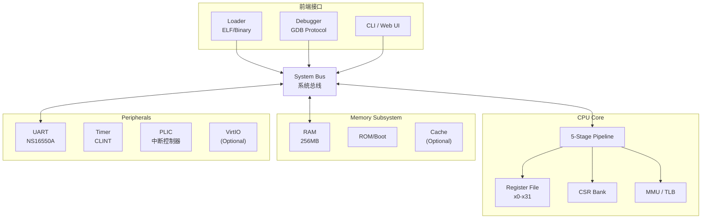

---

## 三、5 级流水线设计

### 流水线阶段

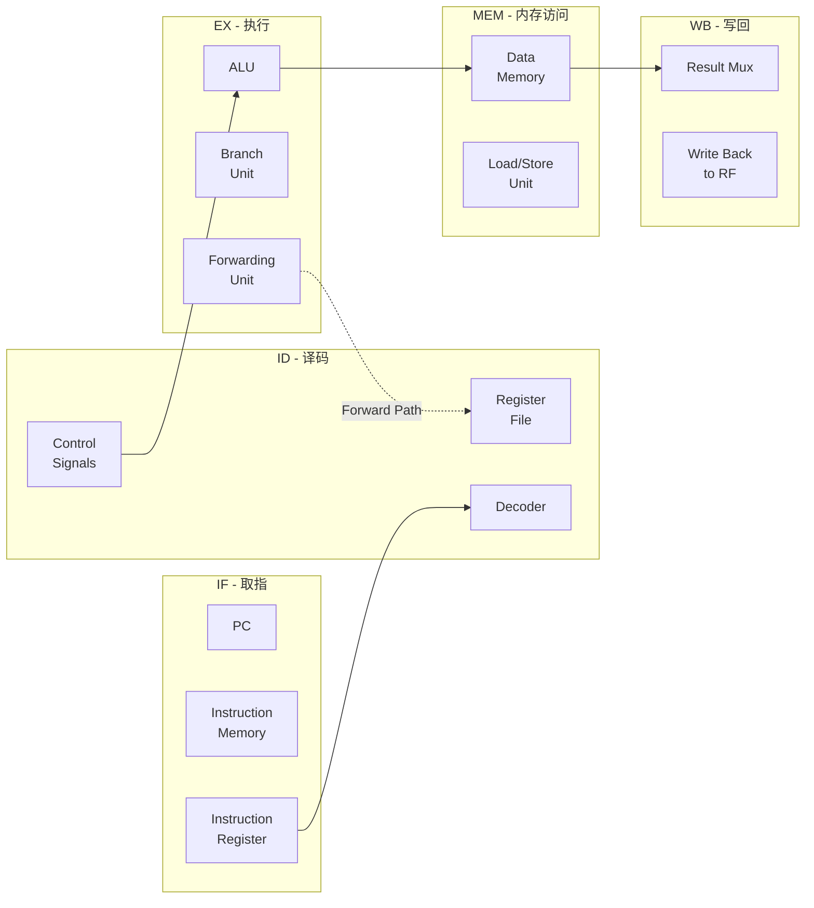

### 流水线寄存器

| 寄存器 | 内容                           |
| ------ | ------------------------------ |
| IF/ID  | PC+4, 指令                     |
| ID/EX  | PC, 操作数, 立即数, 控制信号   |
| EX/MEM | ALU 结果, Store 数据, 控制信号 |
| MEM/WB | 内存数据, ALU 结果, 写回目标   |

### 流水线冒险处理

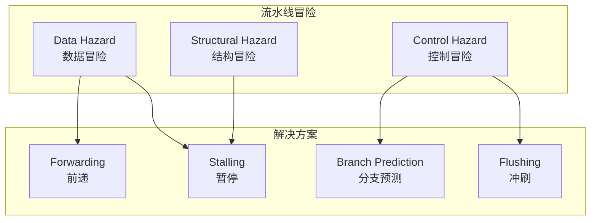

#### 数据冒险 - 前递策略

```
场景: ADD x1, x2, x3  →  SUB x4, x1, x5
      (x1 尚未写回，但 SUB 需要 x1)

解决方案: EX 阶段结果直接前递到 ID 阶段
```

#### 控制冒险 - 分支预测

| 策略         | 说明             | 实现复杂度 |
| ------------ | ---------------- | ---------- |
| 静态预测     | 总是预测不跳转   | 简单       |
| BTFN         | 向后跳转预测跳转 | 简单       |
| 2-bit 预测器 | 基于历史动态预测 | 中等       |
| BTB          | 分支目标缓存     | 复杂       |

**初始实现**: 静态预测 + 暂停 (简化实现)

---

## 四、特权级架构

### M/S/U 三级特权模式

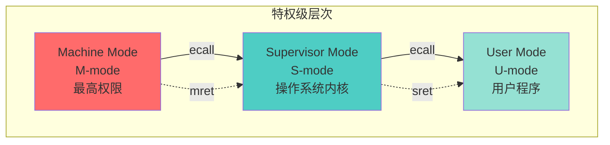

### 各模式权限

| 特权级     | 权限             | 用途                           |
| ---------- | ---------------- | ------------------------------ |
| **M-mode** | 完全访问所有资源 | Bootloader, 固件, 底层异常处理 |
| **S-mode** | 访问 S/U 级资源  | 操作系统内核                   |
| **U-mode** | 受限访问         | 用户应用程序                   |

### CSR 寄存器分布

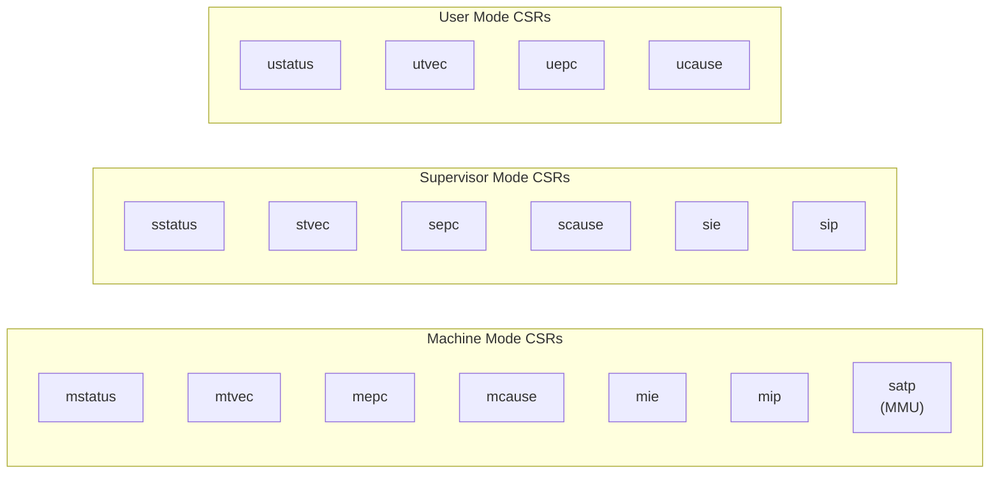

### 异常/中断处理流程

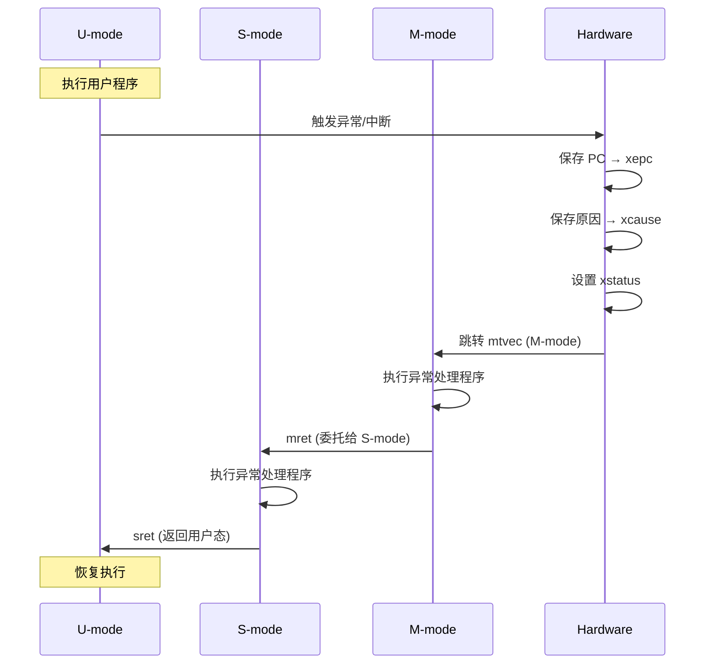

---

## 五、模块详细设计

### 1. CPU Core 模块

```
src/cpu/
├── mod.rs           # CPU 主结构
├── registers.rs     # 寄存器组 (x0-x31 + PC)
├── csr.rs           # 控制状态寄存器
├── pipeline/
│   ├── mod.rs       # 流水线控制
│   ├── fetch.rs     # IF 阶段
│   ├── decode.rs    # ID 阶段
│   ├── execute.rs   # EX 阶段
│   ├── memory.rs    # MEM 阶段
│   ├── writeback.rs # WB 阶段
│   ├── hazard.rs    # 冒险检测与处理
│   └── forward.rs   # 前递逻辑
├── alu.rs           # 算术逻辑单元
├── branch.rs        # 分支单元
└── privilege.rs     # 特权级管理
```

### 2. 指令集模块

```
src/instruction/
├── mod.rs           # 指令定义
├── decoder.rs       # 译码器
├── opcode.rs        # 操作码枚举
├── format/
│   ├── r_type.rs    # R-type: ADD, SUB, AND, OR, XOR...
│   ├── i_type.rs    # I-type: ADDI, ANDI, LB, LW...
│   ├── s_type.rs    # S-type: SB, SH, SW
│   ├── b_type.rs    # B-type: BEQ, BNE, BLT...
│   ├── u_type.rs    # U-type: LUI, AUIPC
│   └── j_type.rs    # J-type: JAL, JALR
└── extension/
    ├── m_ext.rs     # M 扩展: MUL, DIV...
    └── c_ext.rs     # C 扩展: 压缩指令
```

### 3. 内存模块

```
src/memory/
├── mod.rs           # 内存抽象接口
├── bus.rs           # 系统总线
├── ram.rs           # RAM 实现
├── rom.rs           # ROM/Bootloader
├── mmu/
│   ├── mod.rs       # MMU 接口
│   ├── tlb.rs       # TLB 缓存
│   ├── page_table.rs # 页表管理
│   └── sv32.rs      # Sv32 分页实现
└── address.rs       # 地址空间定义

> 2026-03-31 进展说明：当前仓库已在 `src/cpu/mmu.rs` 实现 Sv32 软件页表遍历（两级 walk），并在**单周期 CPU**的取指与 Load/Store 路径接入翻译入口；页故障已接入 trap 流程。
```

### 4. 中断模块

```
src/interrupt/
├── mod.rs           # 中断抽象
├── plic.rs          # 平台级中断控制器
├── clint.rs         # 核心本地中断器
├── exception.rs     # 异常处理
└── trap.rs          # 陷阱处理
```

### 4.1 NPU/LPU MMIO 协处理器（新增）

```
src/peripheral/
├── npu.rs           # NPU: Add/Mul/Max/Relu
└── lpu.rs           # LPU: And/Or/Xor/Shifts
```

- NPU 基地址：`0x2000_0000`
- LPU 基地址：`0x2000_1000`
- 统一寄存器风格：`CONTROL/STATUS/OP_A/OP_B/RESULT/OPCODE/CYCLES`
- 中断模型：计算完成后置位 `IRQ_PENDING`，CPU 可通过总线轮询并确认

### 5. 外设模块

```
src/peripheral/
├── mod.rs           # Peripheral trait
├── uart.rs          # NS16550A 兼容串口
├── timer.rs         # 定时器
└── virtio/
    ├── mod.rs       # VirtIO 抽象
    ├── blk.rs       # VirtIO Block
    └── net.rs       # VirtIO Net
```

---

## 六、内存地址映射

```
地址空间布局 (Sv32 物理地址):

0x0000_0000 ─ 0x0FFF_FFFF  RAM (256 MB)
0x1000_0000 ─ 0x1000_FFFF  ROM / Bootloader (64 KB)
0x0200_0000 ─ 0x0200_FFFF  CLINT (Core Local Interruptor)
0x0C00_0000 ─ 0x0FFF_FFFF  PLIC (Platform Level Interrupt Controller)
0x1000_1000 ─ 0x1000_1FFF  UART (Serial Port)
0x2000_0000 ─ 0x2000_00FF  NPU (MMIO Coprocessor)
0x2000_1000 ─ 0x2000_10FF  LPU (MMIO Coprocessor)
0x2001_0000 ─ 0x2FFF_FFFF  VirtIO Devices
0x8000_0000 ─ 0xFFFF_FFFF  Reserved / Expansion
```

### Sv32 当前实现边界（里程碑）

- 已完成：
    - Bare/Sv32 模式分流
    - 两级页表遍历（根表 + 次级表）
    - Instruction/Load/Store 权限位检查（X/R/W）
    - 页故障触发 `InstructionPageFault/LoadPageFault/StorePageFault`
- 暂未完成：
    - TLB / ASID 相关优化
    - A/D 位硬件更新语义
    - 细粒度权限语义（SUM/MXR）与缺页性能优化

---

## 七、开发阶段规划

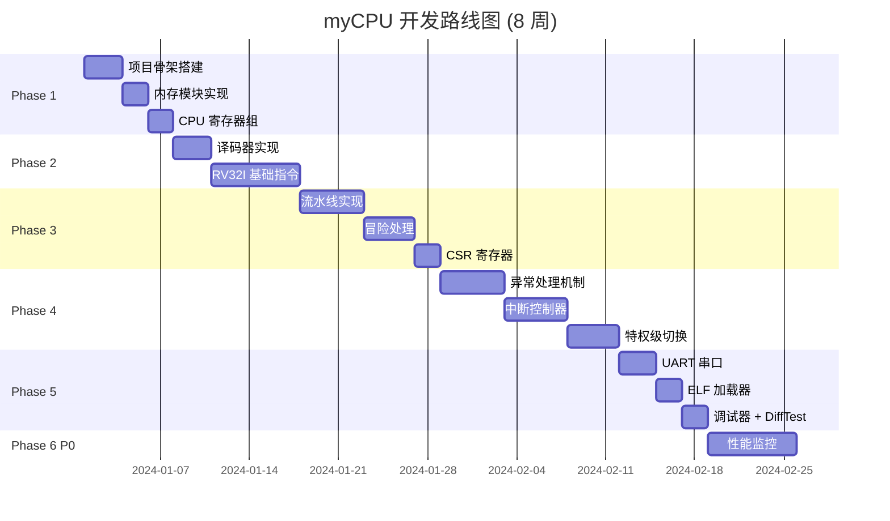

---

## 八、测试策略

### 核心方案: QEMU 差分测试 (DiffTest)

采用与 QEMU 逐指令对比的差分测试策略，确保模拟器行为与参考实现完全一致。

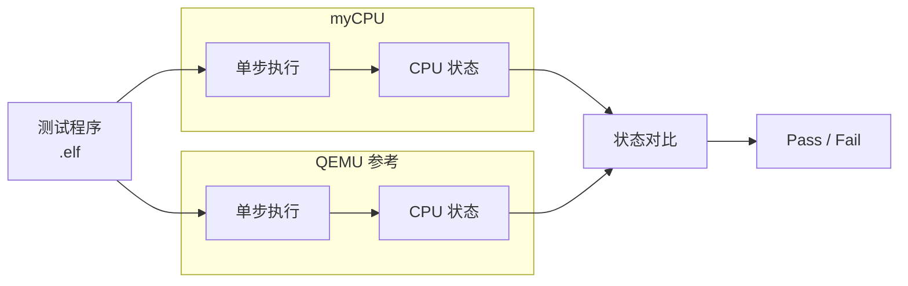

### 差分测试架构

```rust
// 核心数据结构示意
struct DiffTestRunner {
    my_cpu: MyCpu,           // 待测模拟器
    qemu: QemuInstance,      // QEMU 参考实例
    compare_mask: CompareMask, // 需要对比的状态
}

struct CpuState {
    regs: [u32; 32],         // 通用寄存器
    pc: u32,                 // 程序计数器
    mode: PrivilegeMode,     // 特权级
    csrs: HashMap<u16, u32>, // CSR 寄存器
}

impl DiffTestRunner {
    fn step_and_compare(&mut self) -> Result<(), DiffError> {
        // 1. 单步执行 myCPU
        let my_state = self.my_cpu.step();

        // 2. 单步执行 QEMU
        let qemu_state = self.qemu.step();

        // 3. 对比状态
        self.compare_states(&my_state, &qemu_state)?;

        Ok(())
    }

    fn compare_states(&self, a: &CpuState, b: &CpuState) -> Result<(), DiffError> {
        // 对比 PC
        if a.pc != b.pc {
            return Err(DiffError::PcMismatch { my: a.pc, qemu: b.pc });
        }

        // 对比通用寄存器 (跳过 x0)
        for i in 1..32 {
            if a.regs[i] != b.regs[i] {
                return Err(DiffError::RegMismatch {
                    reg: i, my: a.regs[i], qemu: b.regs[i]
                });
            }
        }

        // 对比关键 CSR
        for csr in &[0x300, 0x305, 0x341] { // mstatus, mtvec, mepc
            if a.csrs.get(csr) != b.csrs.get(csr) {
                return Err(DiffError::CsrMismatch {
                    csr: *csr,
                    my: a.csrs.get(csr).copied(),
                    qemu: b.csrs.get(csr).copied()
                });
            }
        }

        Ok(())
    }
}
```

### QEMU 集成方式

**方案 A: GDB Stub (推荐)**

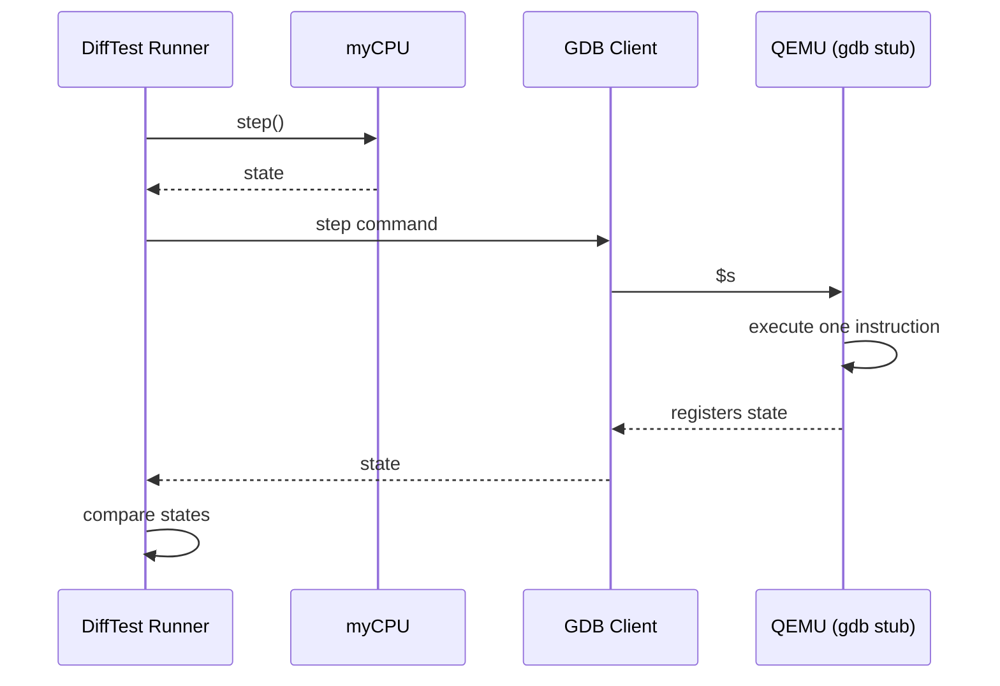

```bash
# 启动 QEMU GDB Stub
qemu-system-riscv32 -M virt -nographic -kernel test.elf -s -S

# -s: 开启 GDB server (端口 1234)
# -S: 启动时暂停
```

**方案 B: QEMU Plugin API**

```c
// QEMU 插件: 每条指令后导出状态
#include <qemu-plugin.h>

static void vcpu_insn_exec(unsigned int cpu_index, void *udata)
{
    // 导出寄存器状态到共享内存
    export_cpu_state(cpu_index);
}

QEMU_PLUGIN_EXPORT int qemu_plugin_install(qemu_plugin_id_t id)
{
    qemu_plugin_register_vcpu_insn_exec_cb(id, vcpu_insn_exec,
                                           QEMU_PLUGIN_CB_NO_REGS, NULL);
    return 0;
}
```

### 测试层次

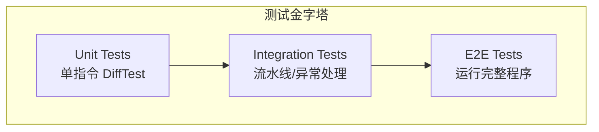

### 测试程序来源

| 来源                 | 用途                 | 优先级 |
| -------------------- | -------------------- | ------ |
| **riscv-tests**      | ISA 指令正确性验证   | P0     |
| **自定义单元测试**   | 边界情况、异常场景   | P0     |
| **CoreMark**         | 性能基准、复杂流水线 | P1     |
| **自编译 Rust 程序** | 真实程序运行验证     | P1     |
| **riscv-torture**    | 压力测试、随机指令   | P2     |

### CI/CD 集成

```yaml
# .github/workflows/test.yml
name: DiffTest

on: [push, pull_request]

jobs:
  difftest:
    runs-on: ubuntu-latest
    steps:
      - uses: actions/checkout@v4

      - name: Install QEMU
        run: sudo apt install qemu-system-riscv32

      - name: Build myCPU
        run: cargo build --release

      - name: Run DiffTest
        run: cargo test --release --features difftest

      - name: Run riscv-tests
        run: ./scripts/run_riscv_tests.sh
```

---

## 九、调试接口

### 核心方案: GDB Remote Serial Protocol (RSP)

实现 GDB Remote Protocol，支持与 GDB、VSCode、CLion 等 IDE 联调。

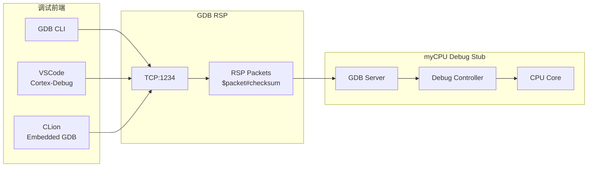

### RSP 协议实现

**数据包格式:**

```
发送: $<packet-data>#<checksum>
应答: + (确认) 或 - (重传)

示例: $g#67
      请求读取所有寄存器，校验和 0x67
```

**核心命令实现:**

| 命令              | 功能           | 实现说明             |
| ----------------- | -------------- | -------------------- |
| `?`               | 查询停止原因   | 返回 `S05` (SIGTRAP) |
| `g`               | 读取所有寄存器 | 返回 32 个 GPR + PC  |
| `G<data>`         | 写入所有寄存器 | 设置寄存器值         |
| `m addr,len`      | 读取内存       | 十六进制返回         |
| `M addr,len:data` | 写入内存       | 修改内存             |
| `c [addr]`        | 继续执行       | 可选指定地址         |
| `s [addr]`        | 单步执行       | 执行一条指令         |
| `Z0,addr,kind`    | 设置软件断点   | kind=2 或 4          |
| `z0,addr,kind`    | 清除断点       | 移除断点             |
| `Z1,addr,kind`    | 设置硬件断点   | 可选实现             |
| `qSupported`      | 查询支持特性   | 返回能力列表         |
| `qAttached`       | 查询附加状态   | 返回是否已附加       |

**Rust 实现结构:**

```rust
pub struct GdbServer {
    listener: TcpListener,
    cpu: Cpu,
    breakpoints: HashSet<u32>,
    running: bool,
}

impl GdbServer {
    pub fn run(&mut self, port: u16) -> Result<()> {
        self.listener = TcpListener::bind(("127.0.0.1", port))?;

        loop {
            let (mut stream, _) = self.listener.accept()?;
            self.handle_connection(&mut stream)?;
        }
    }

    fn handle_packet(&mut self, packet: &str) -> Option<String> {
        let (cmd, args) = Self::parse_packet(packet);

        match cmd {
            "?" => Some(self.query_stop_reason()),
            "g" => Some(self.read_registers()),
            "G" => self.write_registers(args),
            "m" => self.read_memory(args),
            "M" => self.write_memory(args),
            "c" => self.continue_exec(args),
            "s" => self.step(args),
            "Z" => self.set_breakpoint(args),
            "z" => self.clear_breakpoint(args),
            "q" => self.handle_query(args),
            _ => Some(String::new()), // 空响应表示不支持
        }
    }

    fn read_registers(&self) -> String {
        let mut result = String::new();
        // 32 个通用寄存器
        for i in 0..32 {
            result.push_str(&format!("{:08x}", self.cpu.regs[i].to_le()));
        }
        // PC
        result.push_str(&format!("{:08x}", self.cpu.pc.to_le()));
        result
    }

    fn set_breakpoint(&mut self, args: &str) -> Option<String> {
        // Z0,addr,kind
        let parts: Vec<&str> = args.split(',').collect();
        if parts.len() >= 2 {
            let addr = u32::from_str_radix(parts[1], 16).ok()?;
            self.breakpoints.insert(addr);
            return Some("OK".to_string());
        }
        None
    }
}
```

### VSCode 集成配置

```json
// .vscode/launch.json
{
    "version": "0.2.0",
    "configurations": [
        {
            "name": "Debug myCPU",
            "type": "gdbtarget",
            "request": "attach",
            "gdbpath": "riscv32-unknown-elf-gdb",
            "executable": "${workspaceFolder}/target.elf",
            "target": {
                "host": "localhost",
                "port": 1234
            },
            "autorun": [
                "monitor reset",
                "load"
            ]
        }
    ]
}
```

### CLI 调试命令 (GDB)

```bash
# 连接 myCPU
riscv32-unknown-elf-gdb target.elf
(gdb) target remote localhost:1234

# 基本调试命令
(gdb) info registers          # 查看寄存器
(gdb) x/10i $pc              # 反汇编当前位置
(gdb) x/10xw 0x80000000      # 查看内存
(gdb) break *0x80000100      # 设置断点
(gdb) continue               # 继续执行
(gdb) stepi                  # 单步执行
(gdb) backtrace              # 调用栈
```

### 调试功能规划

| 阶段             | 功能       | 命令                         |
| ---------------- | ---------- | ---------------------------- |
| **Phase 5 基础** | 基础命令   | `g`, `G`, `m`, `M`, `c`, `s` |
| **Phase 5 基础** | 软件断点   | `Z0`, `z0`                   |
| **扩展**         | 查询命令   | `qSupported`, `qAttached`    |
| **扩展**         | 多线程支持 | `H`, `g`, `T`                |
| **高级**         | 观察点     | `Z2`, `z2` (数据断点)        |
| **高级**         | 指令追踪   | 自定义命令                   |

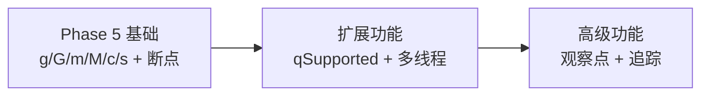

---

## 十一、关键设计决策

| 决策项       | 选择                       | 理由                             |
| ------------ | -------------------------- | -------------------------------- |
| 目标架构     | **RISC-V RV32I**           | 规范开放、指令简洁、生态完善     |
| 流水线深度   | **5 级** (IF/ID/EX/MEM/WB) | 经典设计，平衡复杂度与性能       |
| 特权级       | **M + S + U**              | 完整支持，便于后续 OS 开发       |
| 分支预测     | 静态预测 + 暂停            | 初期简化，后续可升级             |
| MMU          | Sv32 分页                  | RV32 标准，支持虚拟内存          |
| 外设接口     | Memory-Mapped I/O          | RISC-V 标准，易于扩展            |
| **测试策略** | **QEMU 差分测试**          | 与参考实现逐指令对比，确保正确性 |
| **调试接口** | **GDB Remote Protocol**    | 工业标准，支持 GDB/IDE 联调      |

---

## 十二、可扩展性设计

为确保架构在后期迭代中不需要大规模重构，采用以下抽象层设计。

### 1. 执行模型抽象

支持单周期执行与 5 级流水线之间的切换，便于调试和性能对比。

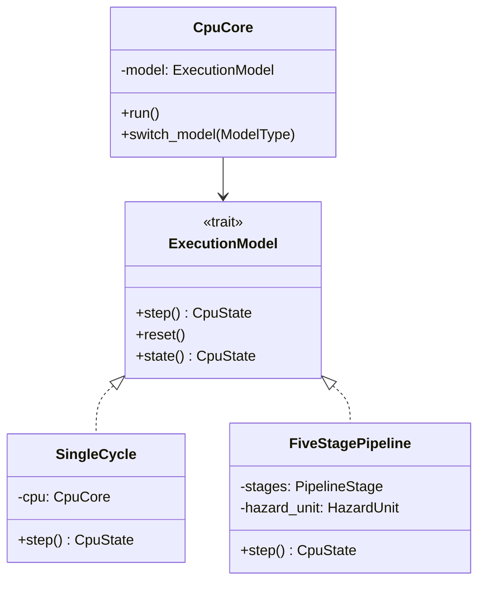

**Rust 接口定义：**

```rust
/// 执行模型抽象
pub trait ExecutionModel {
    /// 执行一条指令，返回执行后的状态
    fn step(&mut self) -> CpuState;

    /// 重置到初始状态
    fn reset(&mut self);

    /// 获取当前状态快照
    fn state(&self) -> CpuState;

    /// 当前正在执行的指令 (用于调试)
    fn current_instruction(&self) -> Option<u32>;
}

/// CPU 核心，可切换执行模型
pub struct CpuCore {
    model: Box<dyn ExecutionModel>,
    memory: Arc<RwLock<dyn Memory>>,
}

impl CpuCore {
    /// 切换执行模型 (运行时)
    pub fn switch_model(&mut self, model_type: ModelType) -> Result<()> {
        let state = self.model.state();
        self.model = match model_type {
            ModelType::SingleCycle => Box::new(SingleCycle::from_state(state, &self.memory)),
            ModelType::Pipeline => Box::new(FiveStagePipeline::from_state(state, &self.memory)),
        };
        Ok(())
    }
}

pub enum ModelType {
    SingleCycle,
    Pipeline,
}
```

**使用场景：**

| 场景          | 推荐模型    | 原因               |
| ------------- | ----------- | ------------------ |
| DiffTest 调试 | SingleCycle | 状态简单，易于对比 |
| 功能验证      | SingleCycle | 排除流水线干扰     |
| 性能测试      | Pipeline    | 真实性能指标       |
| 运行 OS       | Pipeline    | 完整功能           |

---

### 2. CSR 注册表模式

统一管理所有 CSR 寄存器，新增 CSR 只需实现 trait 并注册。

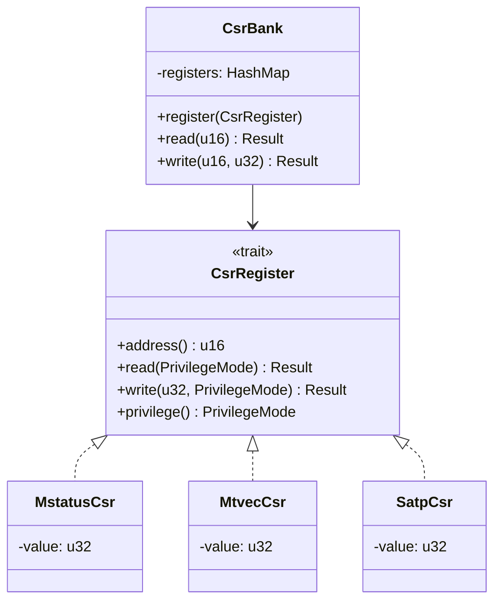

**Rust 接口定义：**

```rust
/// CSR 寄存器抽象
pub trait CsrRegister: Send + Sync {
    /// CSR 地址 (如 0x300 = mstatus)
    fn address(&self) -> u16;

    /// 读取值 (带权限检查)
    fn read(&self, mode: PrivilegeMode) -> Result<u32, CsrError>;

    /// 写入值 (带权限检查)
    fn write(&mut self, value: u32, mode: PrivilegeMode) -> Result<(), CsrError>;

    /// 所属特权级
    fn privilege(&self) -> PrivilegeMode;

    /// 是否可写 (某些 CSR 只读)
    fn writable(&self) -> bool { true }

    /// 字段掩码 (哪些位可写)
    fn write_mask(&self) -> u32 { 0xFFFF_FFFF }
}

/// CSR 注册表
pub struct CsrBank {
    registers: HashMap<u16, Box<dyn CsrRegister>>,
}

impl CsrBank {
    pub fn new() -> Self {
        let mut bank = Self { registers: HashMap::new() };

        // 注册标准 CSR
        bank.register(Box::new(MstatusCsr::new()));
        bank.register(Box::new(MtvecCsr::new()));
        bank.register(Box::new(MepcCsr::new()));
        bank.register(Box::new(McauseCsr::new()));
        bank.register(Box::new(SatpCsr::new()));
        // ... 更多

        bank
    }

    /// 注册新的 CSR (支持扩展)
    pub fn register(&mut self, csr: Box<dyn CsrRegister>) {
        self.registers.insert(csr.address(), csr);
    }

    pub fn read(&self, addr: u16, mode: PrivilegeMode) -> Result<u32, CsrError> {
        self.registers
            .get(&addr)
            .ok_or(CsrError::NotFound(addr))
            .and_then(|r| r.read(mode))
    }

    pub fn write(&mut self, addr: u16, value: u32, mode: PrivilegeMode) -> Result<(), CsrError> {
        let csr = self.registers
            .get_mut(&addr)
            .ok_or(CsrError::NotFound(addr))?;

        // 检查权限
        if mode < csr.privilege() {
            return Err(CsrError::PrivilegeViolation);
        }

        // 应用写掩码
        let masked_value = value & csr.write_mask();
        csr.write(masked_value, mode)
    }
}
```

**扩展新 CSR 示例：**

```rust
// 添加自定义 CSR 只需实现 trait
pub struct MyCustomCsr {
    value: u32,
}

impl CsrRegister for MyCustomCsr {
    fn address(&self) -> u16 { 0x7C0 } // 自定义地址范围
    fn read(&self, mode: PrivilegeMode) -> Result<u32, CsrError> {
        if mode < PrivilegeMode::Machine {
            return Err(CsrError::PrivilegeViolation);
        }
        Ok(self.value)
    }
    fn write(&mut self, value: u32, mode: PrivilegeMode) -> Result<(), CsrError> {
        if mode < PrivilegeMode::Machine {
            return Err(CsrError::PrivilegeViolation);
        }
        self.value = value;
        Ok(())
    }
    fn privilege(&self) -> PrivilegeMode { PrivilegeMode::Machine }
}

// 注册
csr_bank.register(Box::new(MyCustomCsr::new()));
```

---

### 3. 外设中断接口扩展

完善 `Peripheral` trait，支持中断声明和查询。

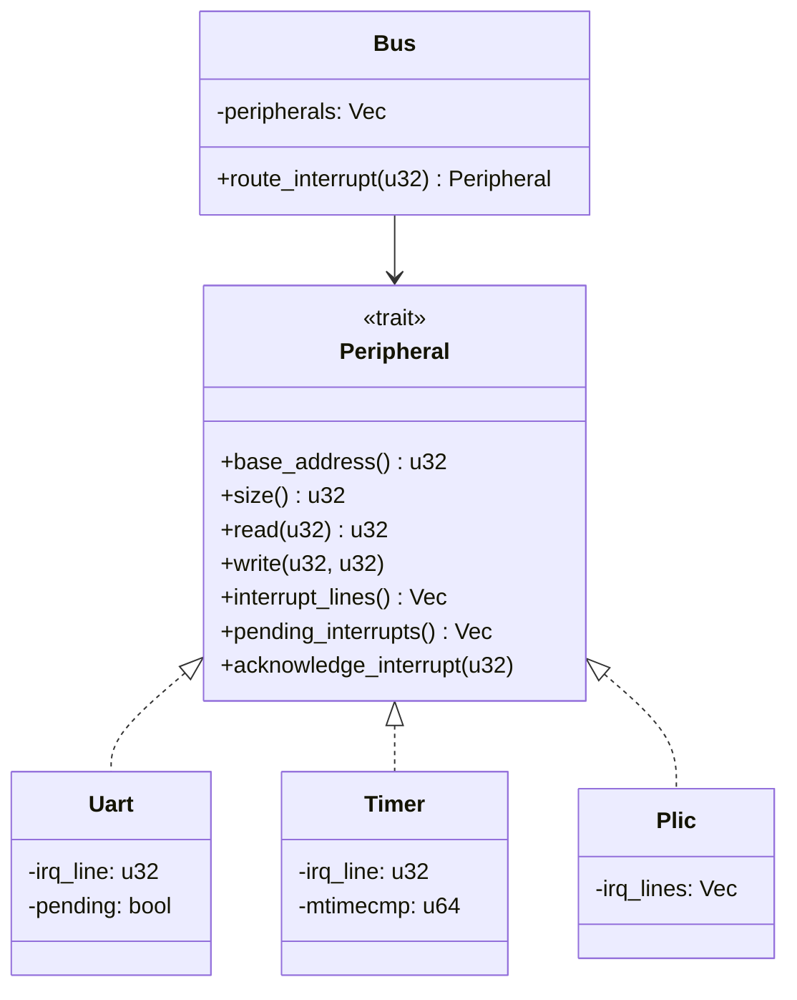

**Rust 接口定义：**

```rust
/// 外设抽象 (扩展版)
pub trait Peripheral: Send + Sync {
    /// 基地址
    fn base_address(&self) -> u32;

    /// 地址空间大小
    fn size(&self) -> u32;

    /// 相对地址读取
    fn read(&self, offset: u32) -> u32;

    /// 相对地址写入
    fn write(&mut self, offset: u32, value: u32);

    /// 声明的中断线 (PLIC IRQ 编号)
    fn interrupt_lines(&self) -> Vec<u32> { vec![] }

    /// 当前待处理的中断
    fn pending_interrupts(&self) -> Vec<u32> { vec![] }

    /// 确认中断 (中断处理完成后调用)
    fn acknowledge_interrupt(&mut self, _irq: u32) {}

    /// 外设名称 (调试用)
    fn name(&self) -> &str { "unknown" }
}

/// UART 实现示例
pub struct Uart {
    base: u32,
    irq_line: u32,        // PLIC IRQ 编号
    pending_tx: bool,
    pending_rx: bool,
    // ... 寄存器
}

impl Peripheral for Uart {
    fn base_address(&self) -> u32 { self.base }
    fn size(&self) -> u32 { 0x1000 }
    fn name(&self) -> &str { "UART0" }

    fn interrupt_lines(&self) -> Vec<u32> {
        vec![self.irq_line]
    }

    fn pending_interrupts(&self) -> Vec<u32> {
        if self.pending_tx || self.pending_rx {
            vec![self.irq_line]
        } else {
            vec![]
        }
    }

    fn acknowledge_interrupt(&mut self, irq: u32) {
        if irq == self.irq_line {
            self.pending_tx = false;
            self.pending_rx = false;
        }
    }

    fn read(&self, offset: u32) -> u32 { /* ... */ }
    fn write(&mut self, offset: u32, value: u32) { /* ... */ }
}
```

---

### 4. DiffTest 快照接口

支持多层次状态对比，可扩展对比粒度。

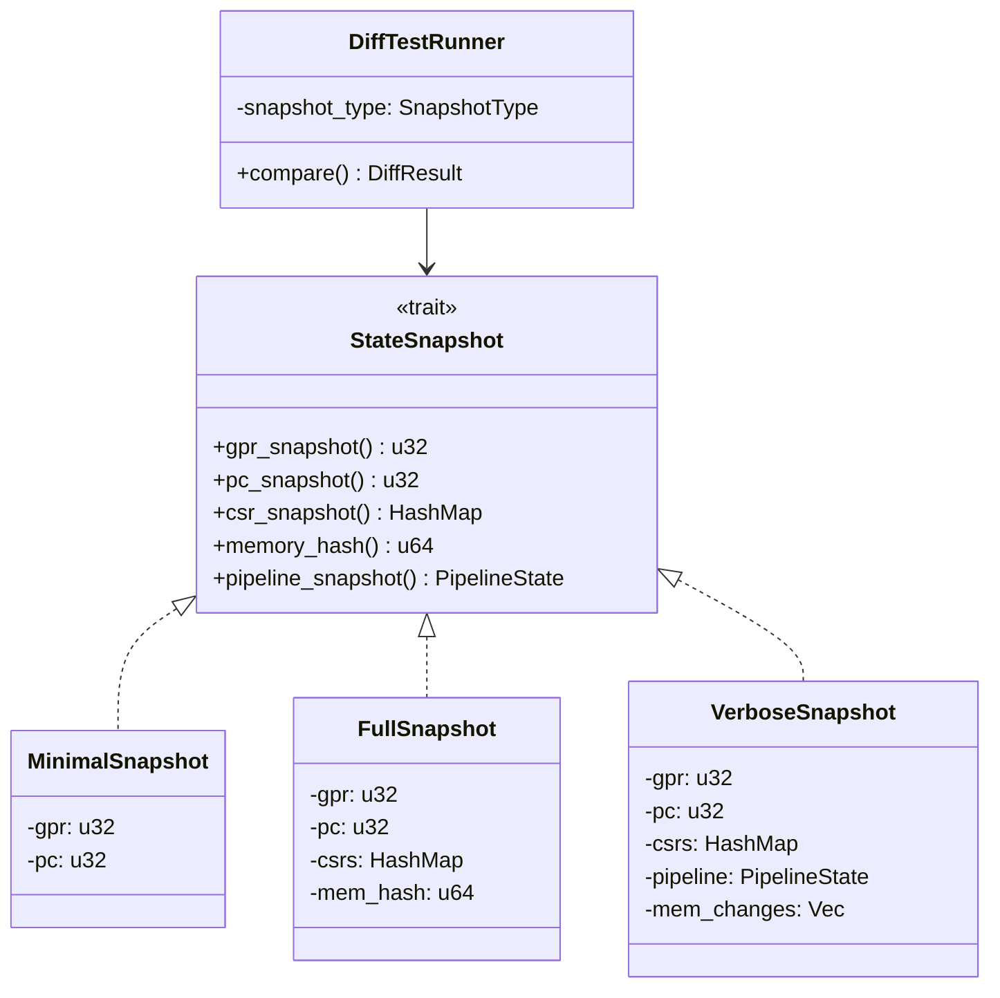

**Rust 接口定义：**

```rust
/// 状态快照抽象
pub trait StateSnapshot {
    /// 通用寄存器快照
    fn gpr_snapshot(&self) -> [u32; 32];

    /// PC 快照
    fn pc_snapshot(&self) -> u32;

    /// CSR 快照 (可选)
    fn csr_snapshot(&self) -> Option<HashMap<u16, u32>> { None }

    /// 内存哈希 (可选，用于快速检测内存变化)
    fn memory_hash(&self) -> Option<u64> { None }

    /// 流水线状态 (可选，用于深度调试)
    fn pipeline_snapshot(&self) -> Option<PipelineState> { None }

    /// 特权模式
    fn privilege_mode(&self) -> PrivilegeMode;
}

/// 流水线状态 (用于深度对比)
#[derive(Debug, Clone)]
pub struct PipelineState {
    pub if_stage: IfStageState,
    pub id_stage: IdStageState,
    pub ex_stage: ExStageState,
    pub mem_stage: MemStageState,
    pub wb_stage: WbStageState,
}

/// DiffTest 对比配置
pub struct DiffTestConfig {
    /// 对比层级
    pub snapshot_level: SnapshotLevel,
    /// 需要对比的 CSR 列表
    pub csr_whitelist: Vec<u16>,
    /// 忽略的寄存器 (如 x0)
    pub gpr_ignore: Vec<usize>,
    /// 内存对比范围 (可选)
    pub memory_regions: Vec<(u32, u32)>,
}

pub enum SnapshotLevel {
    /// 最小: 仅 GPR + PC
    Minimal,
    /// 标准: GPR + PC + 关键 CSR
    Standard,
    /// 完整: GPR + PC + 所有 CSR + 内存哈希
    Full,
    /// 详细: 包括流水线内部状态
    Verbose,
}

/// DiffTest 运行器
pub struct DiffTestRunner<M: ExecutionModel> {
    my_cpu: M,
    qemu: QemuInstance,
    config: DiffTestConfig,
}

impl<M: ExecutionModel> DiffTestRunner<M> {
    pub fn step_and_compare(&mut self) -> Result<(), DiffError> {
        // 1. 执行一步
        let my_state = self.my_cpu.step();
        let qemu_state = self.qemu.step()?;

        // 2. 根据配置层级对比
        match self.config.snapshot_level {
            SnapshotLevel::Minimal => {
                self.compare_minimal(&my_state, &qemu_state)?;
            }
            SnapshotLevel::Standard => {
                self.compare_standard(&my_state, &qemu_state)?;
            }
            SnapshotLevel::Full => {
                self.compare_full(&my_state, &qemu_state)?;
            }
            SnapshotLevel::Verbose => {
                self.compare_verbose(&my_state, &qemu_state)?;
            }
        }

        Ok(())
    }

    fn compare_minimal(&self, a: &dyn StateSnapshot, b: &dyn StateSnapshot) -> Result<(), DiffError> {
        // PC 对比
        if a.pc_snapshot() != b.pc_snapshot() {
            return Err(DiffError::PcMismatch {
                my: a.pc_snapshot(),
                qemu: b.pc_snapshot(),
            });
        }

        // GPR 对比 (跳过 x0 和忽略列表)
        for i in 0..32 {
            if self.config.gpr_ignore.contains(&i) {
                continue;
            }
            if a.gpr_snapshot()[i] != b.gpr_snapshot()[i] {
                return Err(DiffError::RegMismatch {
                    reg: i,
                    my: a.gpr_snapshot()[i],
                    qemu: b.gpr_snapshot()[i],
                });
            }
        }

        Ok(())
    }
}
```

---

### 5. 模块依赖关系

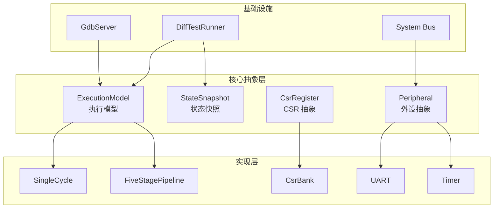

---

### 6. 扩展点总结

| 扩展点     | 抽象接口            | 扩展方式          | 典型场景               |
| ---------- | ------------------- | ----------------- | ---------------------- |
| 执行模型   | `ExecutionModel`    | 实现 trait        | 单周期调试、流水线优化 |
| CSR 寄存器 | `CsrRegister`       | 实现 trait + 注册 | 自定义 CSR、新扩展     |
| 外设       | `Peripheral`        | 实现 trait + 挂载 | VirtIO、自定义外设     |
| 状态对比   | `StateSnapshot`     | 实现 trait        | DiffTest 不同粒度      |
| 指令扩展   | `Instruction` trait | 实现 trait + 注册 | M/F/D/A 扩展           |

---

## 十三、性能监控

### RISC-V HPM 规范实现

myCPU 实现了符合 RISC-V 硬件性能监控 (HPM) 规范的 CSR 寄存器。

#### 性能计数器 CSR

| CSR 地址    | 名称             | 说明                    |
| ----------- | ---------------- | ----------------------- |
| 0xB00       | mcycle           | 周期计数器低 32 位      |
| 0xB80       | mcycleh          | 周期计数器高 32 位      |
| 0xB02       | minstret         | 指令计数器低 32 位      |
| 0xB82       | minstreth        | 指令计数器高 32 位      |
| 0xB03-0xB1F | mhpmcounter3-31  | 可编程计数器 (低 32 位) |
| 0xB83-0xB9F | mhpmcounter3-31h | 可编程计数器 (高 32 位) |
| 0x323-0x33F | mhpmevent3-31    | 事件选择器              |
| 0x320       | mcountinhibit    | 计数器禁止寄存器        |

#### 支持的性能事件

| 事件 ID | 事件名称            | 说明                    |
| ------- | ------------------- | ----------------------- |
| 0       | None                | 禁用计数                |
| 1       | Cycles              | CPU 周期                |
| 2       | InstructionsRetired | 已完成指令              |
| 3       | LoadUseStalls       | Load-Use 暂停周期       |
| 4       | ControlHazards      | 控制冒险 (分支预测错误) |
| 5       | BranchExecuted      | 执行的分支指令          |
| 6       | BranchTaken         | 跳转的分支              |
| 7       | BranchNotTaken      | 未跳转的分支            |
| 8       | MemoryReads         | 内存读取次数            |
| 9       | MemoryWrites        | 内存写入次数            |
| 10      | AluOperations       | ALU 操作次数            |
| 11      | CsrAccesses         | CSR 访问次数            |
| 12      | InterruptsTaken     | 已处理中断数            |
| 13      | PipelineFlushes     | 流水线冲刷次数          |

### 性能收集器架构

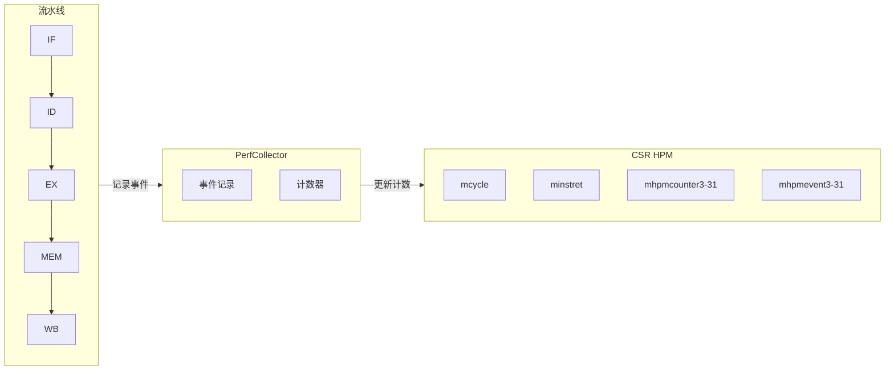

### 性能报告

通过 `--perf-report` CLI 选项生成性能报告：

```bash
cargo run --release -- run --perf-report program.elf
```

输出示例：

```
╔══════════════════════════════════════════════════════════════╗
║                    Performance Report                         ║
╠══════════════════════════════════════════════════════════════╣
║  Execution Summary                                            ║
╠══════════════════════════════════════════════════════════════╣
║  Cycles:                                          1,234,567  ║
║  Instructions:                                      987,654  ║
║  IPC:                                                 0.80   ║
║  CPI:                                                1.25   ║
║  Efficiency:                                        80.0%   ║
╠══════════════════════════════════════════════════════════════╣
║  Pipeline Hazards                                             ║
╠══════════════════════════════════════════════════════════════╣
║  Load-Use Stalls:                                    12,345  ║
║  Control Hazards:                                     8,765  ║
║  Total Stalls:                                       21,110  ║
║  Stall Rate:                                          1.7%   ║
╠══════════════════════════════════════════════════════════════╣
║  Branch Statistics                                            ║
╠══════════════════════════════════════════════════════════════╣
║  Total Branches:                                     45,678  ║
║  Taken:                                              23,456  ║
║  Not Taken:                                          22,222  ║
║  Prediction Acc:                                     51.4%   ║
╠══════════════════════════════════════════════════════════════╣
║  Memory Statistics                                            ║
╠══════════════════════════════════════════════════════════════╣
║  Memory Reads:                                      123,456  ║
║  Memory Writes:                                      45,678  ║
║  Total Mem Ops:                                     169,134  ║
║  Mem Ops/Instr:                                      0.17   ║
╚══════════════════════════════════════════════════════════════╝
```

### 关键实现文件

| 文件                        | 说明                                                    |
| --------------------------- | ------------------------------------------------------- |
| `src/cpu/csr/perf.rs`       | HPM CSR 实现 (Counter64, Mcycle, Minstret, Mhpmcounter) |
| `src/cpu/perf_collector.rs` | 性能事件收集器                                          |
| `src/perf_report.rs`        | 性能报告格式化输出                                      |

---

## 十四、后续扩展

- [ ] Zicsr 扩展 (CSR 指令)
- [ ] Zifencei 扩展 (指令缓存刷新)
- [ ] F/D 扩展 (浮点运算)
- [ ] A 扩展 (原子操作)
- [ ] 多核 SMP 支持
- [ ] JTAG 调试接口
- [ ] ~~性能计数器 (PMU)~~ ✅ 已完成
