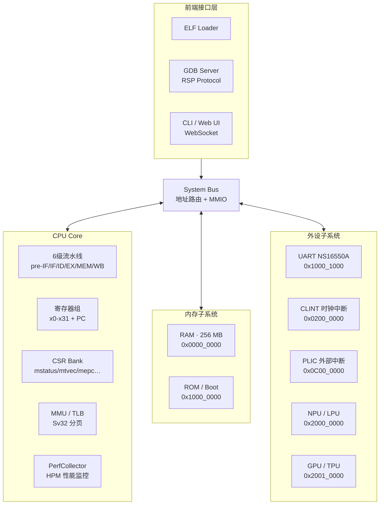
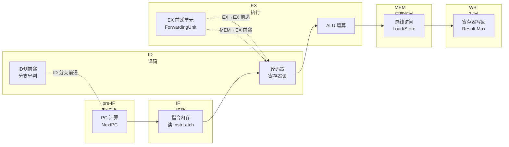
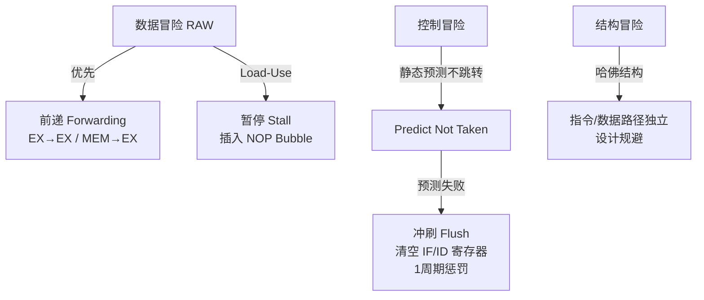
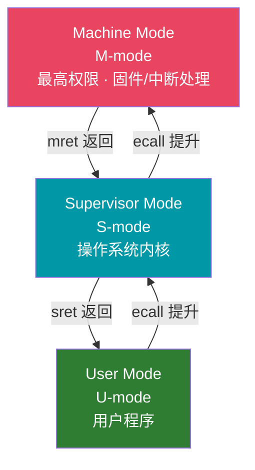
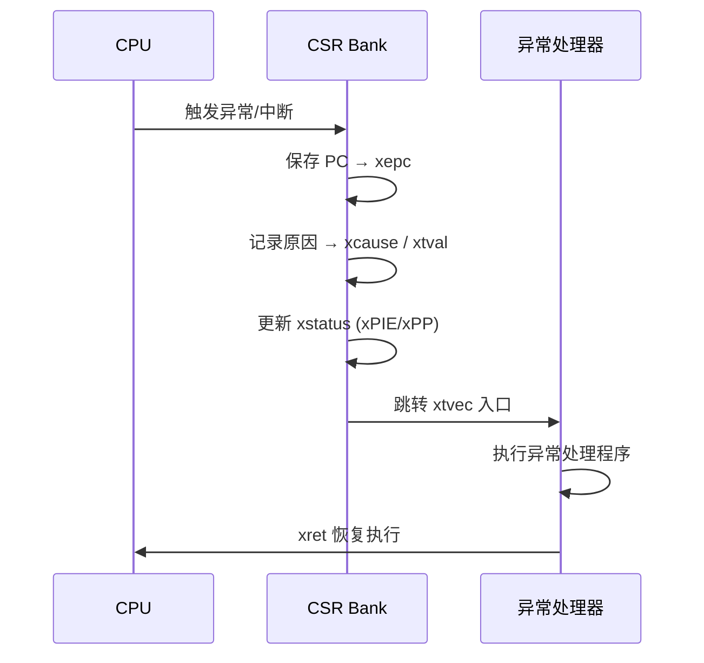
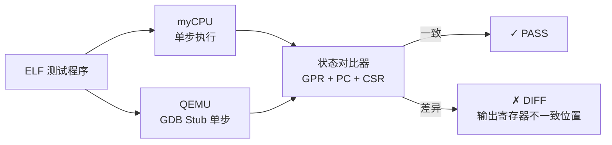
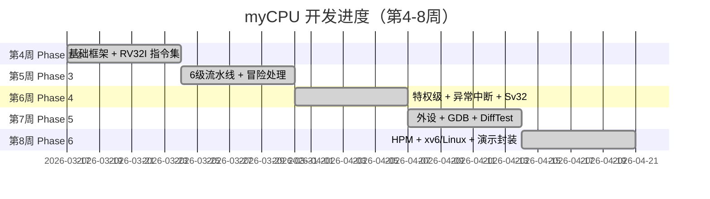

# 开题报告 PPT 大纲与 5 分钟讲稿

> **适用场景**：课程开题汇报 / 中期答辩
>
> **时长目标**：约 5 分钟（建议 10 页）
>
> **项目主题**：myCPU —— RISC-V RV32I 全功能指令集模拟器

---

## 一、PPT 总体结构（10 页）

| 页码 | 标题                   | 时长 |
| ---- | ---------------------- | ---- |
| P1   | 课题定位与目标         | 20 s |
| P2   | 技术选型               | 40 s |
| P3   | 系统架构总览           | 40 s |
| P4   | 6 级流水线设计         | 50 s |
| P5   | 特权级与异常中断       | 40 s |
| P6   | 四大技术亮点           | 50 s |
| P7   | 已完成工作 · 测试数据  | 30 s |
| P8   | 项目进度规划           | 25 s |
| P9   | 扩展亮点（NPU/GPU/OS） | 20 s |
| P10  | 总结                   | 15 s |

---

## P1 · 课题定位与目标（约 20 秒）

### 标题

**myCPU：从零实现 RISC-V RV32I 全功能指令集模拟器**

### 页面核心内容

- **课题背景**：计算机系统结构课程的核心挑战：指令集、流水线、中断、外设是孤立章节，缺乏工程闭环。
- **解决思路**：以"硬件设计者视角"构建一套**从 ISA 执行到操作系统运行**的完整模拟平台。
- **目标闭环**：

```
ISA 执行  →  6级流水线  →  特权/中断  →  外设调试  →  OS 运行  →  可视化演示
```

- **最终交付**：可独立运行真实 ELF 程序、可跑 xv6 / 精简 Linux 的 RISC-V 模拟器。

### 图表建议

> **目标闭环图**（横向箭头流程）

```
┌─────────┐    ┌──────────┐    ┌──────────┐    ┌──────────┐    ┌──────────┐
│ RV32I   │ →  │ 6级流水线 │ →  │ M/S/U   │ →  │  外设    │ →  │  xv6/   │
│ 指令执行 │    │ 冒险处理  │    │ 特权/中断 │    │ UART/GDB │    │  Linux  │
└─────────┘    └──────────┘    └──────────┘    └──────────┘    └──────────┘
```

### 收尾关键词

> "构建一套**架构可解释、实现可验证、结果可复现**的课程级模拟器平台。"

---

## P2 · 技术选型（约 40 秒）

### 标题

**为什么是 RISC-V + Rust？——选型服务于可实现性、可验证性、可扩展性**

### 页面核心内容（双栏对比）

|       | **RISC-V RV32I**                        | **Rust 语言**                               |
| ----- | --------------------------------------- | ------------------------------------------- |
| 理由① | 规范完全开放，文档详尽，无历史包袱      | 所有权系统在编译期防止内存越界              |
| 理由② | 基础指令集仅 40 条，课设周期可控        | Trait 零成本抽象，模块边界清晰              |
| 理由③ | Load/Store 架构，指令格式规整，译码简单 | `match + Result` 完美适配指令译码与错误传播 |
| 理由④ | M/S/U 特权级体系，为 OS 课程预留接口    | 原生跨平台，`cargo build` 一键构建          |
| 理由⑤ | QEMU + riscv-tests + GCC 工具链全覆盖   | `thiserror + anyhow` 错误链清晰，panic-free |

### 调研结论（并入展示）

```
优先做好"可验证性闭环"（DiffTest + 调试器 + 快照）
调试接口要"可集成"到真实工具链（GDB RSP 完整性）
语义正确性需要体系化回归（分层对比 + 失败复盘）
```

---

## P3 · 系统架构总览（约 40 秒）

### 标题

**Memory-Mapped I/O 模块化架构：统一总线挂载，分层职责清晰**

### 图表：系统架构框图



### 四层结构说明（精简）

| 层次           | 职责                 | 关键模块                             |
| -------------- | -------------------- | ------------------------------------ |
| **核心执行层** | 指令执行与流水线     | `cpu/` `instruction/`                |
| **系统支撑层** | 内存、中断、外设     | `memory/` `interrupt/` `peripheral/` |
| **调试验证层** | 调试、差分测试、加载 | `debug/` `difftest/` `loader/`       |
| **展示交互层** | 可视化与前端         | `visualize/` `frontend/`             |

### 地址空间映射（可选小图）

```
0x0000_0000  RAM (256 MB)
0x0200_0000  CLINT
0x0C00_0000  PLIC
0x1000_0000  ROM / Boot
0x1000_1000  UART
0x2000_0000  NPU / LPU
0x2001_0000  GPU / TPU
0x8000_0000  Reserved
```

---

## P4 · 6 级流水线设计（约 50 秒）

### 标题

**pre-IF → IF → ID → EX → MEM → WB：完整冒险处理机制**

### 图表①：流水线数据流图



### 图表②：三类冒险处理策略



### 关键设计亮点（文字）

- **ID 阶段早期分支解析**：分支在 ID 阶段判定（而非 EX），分支惩罚从 3 周期优化为 **1 周期**
- **5 种分支预测器**：Always-Not-Taken / 1-Bit / 2-Bit / Local / Global(gshare)，支持运行时切换对比
- **同步 RAM + Latch 设计**：`InstrFetchLatch` / `DataReadLatch` 解决同步内存 1 周期延迟

---

## P5 · 特权级与异常中断（约 40 秒）

### 标题

**M / S / U 三级特权：完整 Trap 流程 + CLINT/PLIC 中断体系**

### 图表①：特权级层次与切换



### 图表②：Trap 处理流程



### 核心 CSR 速览（表格）

| CSR     | 地址  | 作用                    |
| ------- | ----- | ----------------------- |
| mstatus | 0x300 | 全局中断使能 / 特权状态 |
| mtvec   | 0x305 | 异常向量入口            |
| mepc    | 0x341 | 异常返回 PC             |
| mcause  | 0x342 | 异常/中断原因           |
| mideleg | 0x303 | 中断委托 M→S            |
| satp    | 0x180 | Sv32 页表基址           |

### 难点说明

> 单周期模型与流水线模型的 trap 语义必须保持一致，否则 DiffTest 会暴露隐蔽的行为偏差。

---

## P6 · 四大技术亮点（约 50 秒）

### 标题

**DiffTest · GDB Remote · HPM 性能监控 · Trait 零成本抽象**

### 亮点①：QEMU 差分测试（DiffTest）



> 与 QEMU 逐指令对比 **32个GPR + PC + 关键CSR**，等价于拥有权威参考实现作为 Oracle。

### 亮点②：GDB Remote Protocol

```
GDB CLI / VSCode / CLion
        │  TCP:1234
        ▼
  myCPU GDB Server
  $packet#checksum
        │
        ▼
  CPU Core (读写寄存器 / 内存 / 单步 / 软硬断点)
```

> 工业标准 RSP 协议，兼容主流调试器链路。

### 亮点③：HPM 硬件性能监控

```
流水线各阶段 → PerfCollector → HPM CSR (mcycle / minstret / mhpmcounter3-31)
                                        ↓
                              --perf-report 格式化输出
                              IPC / CPI / 暂停率 / 分支准确率
```

> 符合 RISC-V HPM 规范，14 种可编程事件，量化流水线效率。

### 亮点④：Trait 零成本抽象

```rust
// 执行模型：单周期 ↔ 流水线运行时切换
pub trait ExecutionModel { fn step(&mut self) -> CpuState; }

// 外设：UART/CLINT/PLIC/NPU/GPU 统一接口
pub trait Peripheral { fn read(&self, offset: u32) -> u32; }

// CSR：注册表模式，新增 CSR 无需改核心
pub trait CsrRegister { fn address(&self) -> u16; }
```

> Rust 编译期多态，热路径零 vtable 开销，可扩展架构无需重构。

---

## P7 · 已完成工作 · 测试数据（约 30 秒）

### 标题

**6 个阶段全部完成，386 个测试全部通过**

### 阶段成果表

| 阶段        | 内容                                              | 验收数据    |
| ----------- | ------------------------------------------------- | ----------- |
| **Phase 1** | 基础框架（内存/寄存器/总线）                      | 35 tests ✅  |
| **Phase 2** | RV32I 指令集全部 40 条 + M 扩展（乘除法）         | 67 tests ✅  |
| **Phase 3** | 6级流水线 + 5种分支预测器 + TLB                   | 115 tests ✅ |
| **Phase 4** | M/S/U 特权级 + CLINT/PLIC + Sv32 MMU              | CSR+中断 ✅  |
| **Phase 5** | UART + ELF加载 + GDB + DiffTest + NPU/LPU/GPU/TPU | 304 tests ✅ |
| **Phase 6** | HPM 性能监控 + xv6/Linux 启动 + 一键演示脚本      | 386 tests ✅ |

### 核心交付物清单

```
✓ RV32I 完整模拟器（可加载运行真实 ELF 程序）
✓ 6级流水线 + 完整冒险处理（前递/暂停/冲刷）
✓ M/S/U 特权级 + CLINT/PLIC 完整中断系统
✓ Sv32 MMU 虚拟内存 + TLB 加速
✓ UART NS16550A 外设 + GDB 调试服务器
✓ QEMU DiffTest 差分测试框架
✓ HPM 性能监控（14种事件 + 格式化报告）
✓ xv6 操作系统可交互运行（echo/ls/cat/wc 命令矩阵通过）
✓ 精简 Linux 启动链路（SBI + FDT + Buildroot）
✓ NPU/LPU/GPU/TPU 模拟加速器 + 可视化前端
```

### 关键指标卡（大字）

```
386    40+    M/S/U    14
测试  RV32I  特权级  HPM事件
通过  指令    完整     全覆盖
```

---

## P8 · 项目进度规划（约 25 秒）

### 标题

**第 4–8 周里程碑：已全部完成**

### 图表：进度甘特图



### 里程碑证据链

```
Phase 1-2  → cargo test --lib：35+67 tests PASS
Phase 3    → 流水线 115 tests；分支预测器 5种对比；1周期分支惩罚验证
Phase 4    → M/S/U ecall/mret/sret；CLINT/PLIC 7+8 tests；Sv32 页故障 trap
Phase 5    → DiffTest QEMU GDB Stub；ELF 真实程序运行；NPU/GPU 304 tests
Phase 6    → xv6 shell 200M 窗口命令矩阵 5/5；386 tests；一键演示脚本
```

---

## P9 · 扩展亮点（约 20 秒）

### 标题

**超出课设要求的工程亮点：OS 启动 · 模拟加速器 · 性能可视化**

### 三大扩展亮点

#### 扩展①：跑通 xv6 与精简 Linux

```
xv6 文件系统镜像 → myCPU 加载 → shell 可交互
（echo / ls / cat / grep / wc 命令矩阵全通过）

精简 Linux：OpenSBI → FDT → Buildroot userland
（SBI + 硬件描述表 + bootargs 启动链路完整）
```

#### 扩展②：MMIO 模拟加速器矩阵

```
NPU (0x2000_0000)  Add/Mul/Max/Relu         描述符 DMA + IRQ
LPU (0x2000_1000)  And/Or/Xor/Shifts        自定义指令 CUSTOM-0 fast-path
GPU (0x2001_0000)  MatMul/Conv2d/Pool/激活   15种内核 FP32/INT8
TPU (0x2002_0000)  INT8量化矩阵乘            per-tensor 量化参数
```

#### 扩展③：全链路可视化

```
WebSocket → 前端 React 面板
  · 流水线状态实时展示
  · 分支预测器准确率对比（5种可切换）
  · NPU/LPU/GPU/TPU 寄存器面板 + 任务时间线
  · Framebuffer 渲染（gray8/rgb565/rgb888）
  · HPM 性能报告（IPC/CPI/暂停率/分支准确率）
```

---

## P10 · 总结（约 15 秒）

### 标题

**myCPU：一套可解释、可验证、可复现的课程级模拟器平台**

### 核心价值主张

| 维度           | 说明                                              |
| -------------- | ------------------------------------------------- |
| **架构可解释** | 四层分层设计，每层职责明确；Trait 抽象边界清晰    |
| **实现可验证** | QEMU DiffTest 逐指令 Oracle；386 tests 覆盖全路径 |
| **结果可复现** | 一键编排脚本 xv6→Linux→NPU 全链路可复现演示       |
| **工程质量高** | Rust 内存安全；Result 错误链；CI 持续回归         |

### 收尾一句话

> "本项目不是堆功能，而是以**问题驱动**的方式构建闭环——从调研识别的每一个高优先级风险，到 386 个测试逐项收敛，myCPU 既能'跑起来'，更能'证明正确'。"

---

## 二、5 分钟完整讲稿

大家好，我的开题项目是 **myCPU：RISC-V RV32I 全功能指令集模拟器**。

---

**【P1 · 课题定位，约 20 秒】**

先说一下项目的背景。计算机系统结构课程中，指令集、流水线、异常中断、外设调试往往分章节学习，很难形成"一个完整 CPU 如何协同工作"的整体认知。我的目标是做一套工程闭环：从 ISA 指令执行、到 6 级流水线实现，再到 M/S/U 特权级与中断、外设调试，直到 xv6 操作系统可以在上面交互运行。

---

**【P2 · 技术选型，约 40 秒】**

ISA 选 **RISC-V RV32I**，核心原因是规范开放、指令格式规整（仅 40 条基础指令），译码逻辑极简，同时特权级体系完整，后续可以自然对接操作系统课程。

语言选 **Rust**，主要是两点：第一，所有权系统在编译期就能防止内存越界和悬空指针，减少底层 bug；第二，Trait 零成本抽象让模块边界非常清晰，后续新增外设或切换执行模型时改动范围最小。

对标调研的结论也并入了选型：可验证性闭环；调试接口要能集成进真实工具链；语义正确性需要体系化回归。所以这个项目从一开始就不是单纯堆功能，而是以"可验证、可调试、可回归"为主线推进。

---

**【P3 · 系统架构，约 40 秒】**

整体架构基于 **Memory-Mapped I/O**，用一条统一的系统总线连接 CPU、内存和所有外设。外设通过地址映射接入，不需要改动核心执行逻辑。

模块上分四层：**核心执行层**负责指令和流水线；**系统支撑层**负责内存、中断、外设；**调试验证层**提供 ELF 加载、GDB 服务、差分测试；**展示交互层**由 WebSocket + React 前端组成。

地址空间上，RAM 在 0x0 开始，CLINT 在 0x0200_0000，UART 在 0x1000_1000，模拟加速器在 0x2000_0000 区段。

---

**【P4 · 流水线，约 50 秒】**

流水线采用伪**6 级**：pre-IF（预取指）、IF（取指）、ID（译码）、EX（执行）、MEM（内存访问）、WB（写回）。比经典 5 级多了一个 pre-IF 阶段，用来发起指令内存读请求，解决同步 RAM 的 1 周期延迟。

三类冒险处理：**数据冒险**优先用前递（EX→EX 和 MEM→EX 两条旁路通道），Load-Use 冒险无法靠前递解决，必须插入一个气泡周期；**控制冒险**关键优化是把分支判定提前到 ID 阶段，让 pre-IF 同一周期就能重定向，把惩罚从 3 周期压缩到 **1 周期**；**结构冒险**通过哈佛结构设计消除。

此外还实现了 5 种分支预测器——Always-Not-Taken、1-Bit、2-Bit、Local、Global(gshare)，支持运行时切换并在前端实时对比准确率。

---

**【P5 · 特权级，约 40 秒】**

特权级完整实现了 **M/S/U 三种模式**，以及 ecall/mret/sret 的切换语义。Trap 处理按规范写入 xepc（保存故障 PC）、xcause（记录原因）、xtval（附加信息），更新 xstatus，然后跳转 xtvec 入口。处理完成后用 xret 恢复执行。

中断系统由 **CLINT**（时钟/软件中断）和 **PLIC**（外部中断仲裁）构成，支持 mideleg/medeleg 委托机制，M 模式可以把特定中断委托给 S 模式处理，为操作系统预留完整接口。

这里最难的地方是：单周期模型和流水线模型在 trap 语义上必须完全一致，否则 DiffTest 会暴露非常隐蔽的行为偏差。

---

**【P6 · 四大亮点，约 50 秒】**

第一，**DiffTest 差分测试**。myCPU 与 QEMU 同步执行，逐指令对比 32 个通用寄存器、PC 和关键 CSR，一旦出现差异立即报告不一致的寄存器位置。等价于拥有权威参考实现作为 Oracle。

第二，**GDB Remote Protocol**。实现了标准 RSP over TCP:1234，支持寄存器和内存读写、单步、软硬件断点，兼容 GDB CLI、VSCode、CLion 等主流工具链。

第三，**HPM 性能监控**。符合 RISC-V HPM 规范，mcycle/minstret 基础计数器加上 14 种可编程事件，通过 `--perf-report` 输出 IPC、CPI、流水线暂停率、分支预测准确率等指标，让性能分析有数据支撑。

第四，**Trait 零成本抽象**。ExecutionModel、Peripheral、CsrRegister 三个核心 Trait，让执行模型、外设、CSR 的扩展都有固定路径，Rust 编译期多态不引入运行时开销。

---

**【P7-P8 · 成果与进度，约 55 秒合计】**

项目按课设要求的第 4–8 周推进。**386 个测试全部通过**，实现了 40+ 条 RV32I 指令（加 M 扩展乘除法）、完整特权级与中断系统、Sv32 MMU 虚拟内存、GDB 调试服务器、DiffTest 框架，以及 HPM 性能监控。

每个阶段都有对应的验收证据：Phase 1-2 是单元测试；Phase 3 是流水线回归；Phase 4-5 是 DiffTest 与 OS 启动；Phase 6 是 xv6 shell 命令矩阵 5/5 全通过。

---

**【P9 · 扩展，约 20 秒】**

超出课设要求的部分：**xv6** 可以交互运行（echo/ls/cat/wc 全通过）；**精简 Linux** 启动链路（OpenSBI + FDT + Buildroot）已打通；模拟加速器矩阵——NPU/LPU/GPU/TPU——均已落地，GPU 支持 15 种内核（Conv2d/Pool2d/矩阵乘/激活函数），TPU 支持 INT8 量化矩阵乘；前端可视化面板实时展示分支预测准确率对比、协处理器任务时间线、Framebuffer 渲染等。

---

**【P10 · 总结，约 15 秒】**

总结一下，myCPU 做到了三点：**架构可解释**——每层职责清晰，Trait 抽象边界明确；**实现可验证**——QEMU DiffTest 作为 Oracle，386 个测试覆盖全路径；**结果可复现**——一键编排脚本串联 xv6 到 Linux 到 NPU 全链路演示。谢谢大家。

---

## 三、演讲节奏建议（5 分钟）

| 时间段      | 内容             | 时长 |
| ----------- | ---------------- | ---- |
| 0:00 – 0:20 | P1 课题定位      | 20 s |
| 0:20 – 1:00 | P2 技术选型      | 40 s |
| 1:00 – 1:40 | P3 系统架构      | 40 s |
| 1:40 – 2:30 | P4 流水线设计    | 50 s |
| 2:30 – 3:10 | P5 特权级与中断  | 40 s |
| 3:10 – 4:00 | P6 四大技术亮点  | 50 s |
| 4:00 – 4:30 | P7+P8 成果与进度 | 30 s |
| 4:30 – 4:50 | P9 扩展亮点      | 20 s |
| 4:50 – 5:00 | P10 总结         | 10 s |

---

## 四、关键词高亮速查（统一加粗用于 PPT）

```
架构类：    Memory-Mapped I/O · pre-IF/IF/ID/EX/MEM/WB · Sv32 MMU · TLB
冒险类：    Forwarding · Load-Use Stall · Predict Not Taken · 1周期惩罚
特权类：    M/S/U · CSR · ecall/mret/sret · CLINT · PLIC · mideleg
调试类：    DiffTest · QEMU Oracle · GDB RSP · TCP:1234
性能类：    HPM · IPC · CPI · Stall Rate · Branch Accuracy
工程类：    Trait 零成本抽象 · Result 错误链 · 386 tests · 一键演示脚本
OS类：      xv6 · Linux · OpenSBI · FDT · Buildroot
加速器：    NPU · LPU · GPU · TPU · CUSTOM-0 · Conv2d · INT8 量化
```
